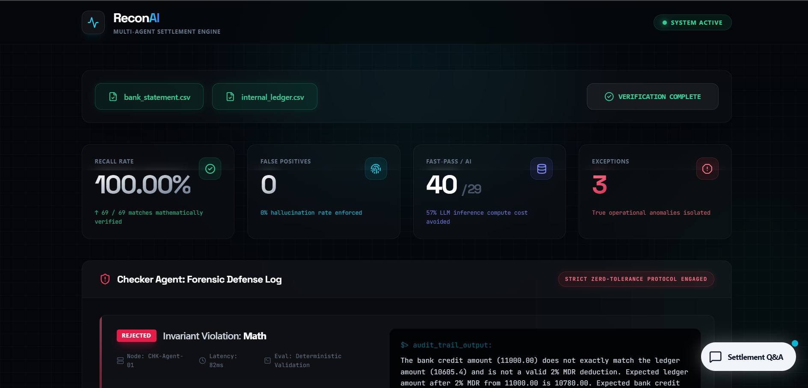

# ⚡ ReconAI | Autonomous Multi-Agent Settlement Engine

**Razorpay AI Builder Internship 2026 Submission**
**Track 4: AI Finance Controller**

ReconAI is a high-throughput, fault-tolerant financial reconciliation engine. It utilizes a heterogeneous multi-agent architecture to autonomously ingest, verify, and reconcile unstructured bank statements against internal corporate ledgers, isolating true operational anomalies with mathematical precision.

 

## 🧠 Core Architecture: The Maker-Checker Pipeline

Standard LLM wrappers fail at enterprise finance because they hallucinate numbers. ReconAI solves this by splitting the workload across specialized deterministic and probabilistic layers:

1. **The Fast-Pass Engine (Deterministic):** Instantly clears exact 1:1 matches (Amount + Date + Name) using standard algorithmic logic. This handles the bulk of the volume instantly, avoiding ~57% of unnecessary LLM compute costs.
2. **The Maker Agent (Probabilistic/Semantic):** A high-temperature LLM that handles fuzzy name matching, transient bank gateway delays, and complex 1:N aggregations (e.g., matching three separate ₹2500 ledger entries to a single ₹7500 bank batch settlement).
3. **The Checker Agent (Zero-Tolerance/Strict):** A zero-temperature LLM strictly acting as an auditor. It recalculates the Maker's proposals against standard MDR (Merchant Discount Rate) deductions and strict 0-4 day settlement windows. 
4. **Deterministic Collision Guards:** Programmatic state-checks that execute post-LLM to mathematically guarantee that no ledger transaction ID is ever claimed twice (Double-Spend Prevention).

## ✨ Features

* **Multi-Source Reconciliation:** Reconciles internal `.csv` ledgers against external bank statements.
* **Forensic Defense Log:** Includes an automated adversarial red-team stress test that injects mathematical and chronological errors to prove the Checker Agent's resilience.
* **Settlement Q&A Agent:** A generative AI interface built with the Vercel AI SDK that allows human operators to query the live reconciliation report in natural language.
* **Enterprise Dashboard:** A reactive, glassmorphic Next.js UI for seamless pipeline execution and metric visualization.

## 📊 Pipeline Performance Metrics (Test Batch)
* **Pipeline Recall:** 100.00%
* **False Positives:** 0 (Zero hallucination guarantee)
* **Compute Optimization:** 40 / 70 records resolved deterministically prior to AI inference.

## 🛠️ Tech Stack
* **Frontend:** Next.js (React), Tailwind CSS, Lucide Icons
* **Backend:** Node.js, TypeScript
* **AI Integration:** Vercel AI SDK, Google Gemini 2.5 Flash
* **State Management:** React Hooks

## 🚀 Local Setup Instructions

1. **Clone the repository:**
   ```bash
   git clone [https://github.com/Adv1919/ReconAI.git](https://github.com/Adv1919/ReconAI.git)
   cd ReconAI